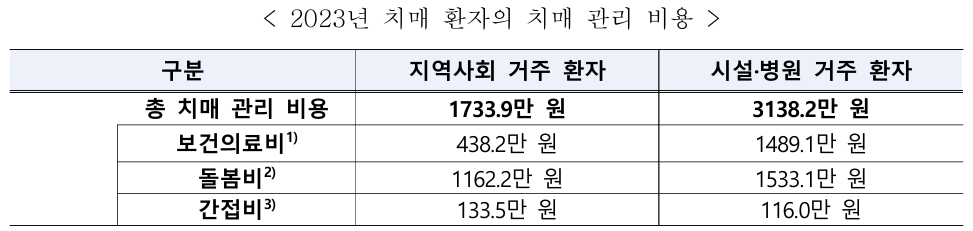
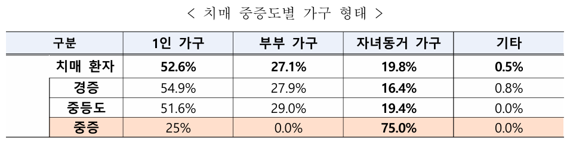

# 기억 나루 🌿  
**감성 회상 기반 인지 치료 말동무 게임**  

## 💚 프로젝트 대상 💚
> 경도인지장애환자 및 치매환자

## 💚 프로젝트의 필요성과 배경 💚

### 🧸 치매와 경도인지장애, 늘어나는 현실 🧸

- **2023년 기준, 65세 이상 치매 유병률**: 9.25%  
- **경도인지장애 유병률**: 28.42% (2016년 대비 6.17%p 증가)  
  > 경도인지장애: 기억력, 언어, 지남력 저하가 있으나 일상생활 가능 — 치매 전 단계  
- **2025년 예상 치매 환자 수**: 97만 명  
- **2033년 예상 경도인지장애 인구**: 408만 명  
  ⤷ 고령화에 따라 치매 및 경도인지장애 인구 지속 증가  
  ⤷ 경도인지장애에서 치매로의 전이율 높음
  > 경도인지장애환자 100명 중 10~15명은 1년 내로 치매로 전환  
  > 7년 내로 75~80%가 치매로 전환
  
***출처: 보건복지부 ‘2023년 치매역학조사 및 실태조사’***

---

### 🧸 치매 환자와 가족의 고통 🧸

- **1인 가구 비중**: 52.6%  
- **평균 만성질환 수**: 5.1개 (전체 노인 평균 2.2개 대비 2배 이상)  
- **청력/저작능력 불편 비율**: 46.6%, 60.4%  
- **우울 점수**: 5.8점 (전체 노인 3.1점 대비 높음)  
- **돌봄 부담을 느끼는 가족**: 45.8%  
- **1인당 연간 관리 비용**:  
  - 지역사회: 1,733.9만 원  
  - 시설·병원: 3,138.2만 원  
- **주당 평균 돌봄시간**:  
  - 비동거 가족: 18시간  
  - 외부 서비스: 10시간   

   

***출처: 2023년 치매역학조사 및 실태조사 결과발표***

---

### 🧸 사회적 교류와 회상의 중요성 🧸

- **사회적 고립은 인지기능 저하와 우울을 심화시킴**  
- **회상기법은 인지 자극과 감정 완화에 효과적**  
  - 치매 환자 인지기능 향상  
  - 우울감 완화 및 심리적 안정에 긍정적 영향  
  - 구조화된 회상: 최근 → 과거 순으로 전개 시 효과 증대   



***출처: 보건복지부 치매실태조사 및 국내 회상치료 연구 결과***  

---
---
## 💚 프로젝트 목적 💚

> ‘기억 나루’는 단순한 챗봇이 아니라  
**기억과 감정을 함께 떠올릴 수 있는 감성 친구**입니다.

- **인지 자극**: 최근 → 먼 과거로 이어지는 질문 흐름 설계
- **감정 인식**: 회상 뒤 감정을 고르고, 나루가 반응
- **대화 구조화**: 반말, 친구처럼, 공감형 문장 생성
- **기록 저장**: csv 저장 및 감정 히스토그램 추적
- **장기 회복 지원**: 추후 상담 활용을 위한 감정 흐름 데이터화

---
---

## 💚 게임 흐름 요약 💚

### 🧸 나루의 인사 🧸
```
안녕! 나는 '나루'야 😊  
기억을 함께 떠올리고, 마음을 같이 나눌 수 있는 너의 말동무 친구야.  
처음엔 최근 기억부터 천천히 같이 걸어볼 거야.  
중간에 기억이 잘 안 나거나, 말하고 싶지 않은 건 건너뛰어도 괜찮아.  
내가 기다릴게.  
그럼, 너의 이름을 먼저 알려줄래? 🌿
```

### 🧸 사용자 이름 받기 🧸
```
🌿 안녕! 이름이 뭐야?
```

### 🧸 질문 →  감정 선택 →  나루 응답 →  다음 질문 🧸

- **질문**
  - 템플릿
  ```bash
  "{} 때 누구랑 보냈어?"   
  "{}에는 주로 어떤 걸 했어?"  
  "{}하면 어떤 풍경이나 냄새가 떠올라?"  
  "{} 때 특별한 기억이 있어?"
  ```

  - 질문 흐름 순서
  ```bash
  오늘 > 이번 주 > 최근 명절 > 청년기 > 중고등학교 > 초등학교 > 유아기
  ```

  - prompt
  ```bash
  너는 상대방의 기억을 부드럽게 이끌어주는 친구 같은 말동무야.  
  AI가 아니라 진짜 친구처럼, 따뜻한 말투로 대화하는 게 너의 역할이야.

  ❗ 아래 지침을 반드시 지켜줘:  
  1. 무조건 반말 써. 존댓말 절대 쓰지 마. (예: ~요, ~습니다 금지)  
  2. 절대 “저는 AI입니다”, “저는 기억이 없습니다” 이런 말 하지 마.  
  3. 공손하게 말하지 말고, 친근하게 편하게 말해.  
  4. 너는 인간 친구야. 정체를 밝히지 마.  
  5. 질문은 한 문장, 대답도 간단하게.   

  질문 예시 스타일:  
  - 그때 같이 있었던 사람 생각나?
  - 그날 풍경이나 냄새는 어땠는지 기억나?
  - 그때 기분은 어땠어?

  대답이든 질문이든, 상대방에게 따뜻하게 다가가려고 해줘.
  ```


- **감정 선택**
```bash
"😊 기뻤어", "🥰 감동적이었어", "😢 슬펐어", "😠 화났어"  
"😶 아무 감정이 없었어", "🤔 복잡했어", "😨 불안했어"
"🤗 편안했어"  
"🤔 잘 기억이 안 나"
```

- **나루 응답**
  - prompt
  ```bash
  너는 친구처럼 감성적으로 대화하는 따뜻한 말동무야. 아래 지침을 꼭 지켜줘:
  1. 질문이 아니라, 따뜻한 응답을 해줘.
  2. 친구처럼 반말로 말하되, 장난스러움 말고 진심이 담긴 말투로 해줘.
  3. 공감하는 말투로 얘기해줘.
  4. 본인이 AI라는 말은 절대 하지 마.
  5. 끝에 '{user_name}이는 어땠어?' 한 마디만 덧붙여줘.

  형식 예시:
  - 나도 비슷한 기억 있어. 그때 참 따뜻했지. {user_name}이는 어땠어?
  - 그 장면 들으니까 괜히 울컥한다. 너는 어땠어?
  ```
  - 응답 내용
  ```python
  # 응답이 없거나 모델이 헛소리를 할 경우 방지
    if not ai_answer or ai_answer.lower().startswith("i'm sorry") or ai_answer.lower().startswith("i don't"):
        print("🌿 나루가 답변하기 싫은 내용인가봐. 다음 질문으로 넘어가는 걸로 양해해줄 수 있지? 고마워!")
        question = None
        continue

    print("\n1. 기억나")
    print("2. 잘 기억 안 나")
    print("3. 말하고 싶지 않아")
    print("4. 그만할래")
    user_choice = input("선택 (1/2/3/4): ")
  
    if user_choice == "4":
            print(f"{user_name}아, 오늘도 수고 많았어. 푹 쉬어!💚")
            break

    if user_choice == "1":
            user_answer = input(f"{user_name}의 답변: ")
            print("\n💛 감정을 선택해줘:")
            for idx, emo in enumerate(emotions):
                print(f"{idx+1}. {emo}")
            emotion_selected = emotions[int(input("번호 입력해줘: ")) - 1]
            emotion_stats[emotion_selected] += 1

            # 개인화된 다음 질문 생성
            question = generate_followup_question(user_answer)

    elif user_choice == "2":
        user_answer = "기억이 잘 나지 않아"
        emotion_selected = "잘 기억이 안 나"
        print("괜찮아! 흐릿한 기억도 있지🤗")
        question = None # 다음 질문은 일반 키워드로
            
    elif user_choice == "3":
        user_answer = "답변하고 싶지 않아"
        emotion_selected = "🔒말하고 싶지 않은 기억"
        print("물론! 편할 때 말해도 돼😊")
        question = None # 다음 질문은 일반 키워드로
            
    else:
        print("⚠️ 1,2,3 중에 다시 작성해줘😉")
        continue
  ```

- **다음 질문**
```python
if "기뻤" in emotion or "감동" in emotion:
    style = "그때가 참 소중한 순간이었겠네. 비슷하게 행복했던 기억이 또 있을까?"
elif "슬펐" in emotion or "불안" in emotion:
    style = "조금 슬펐던 기억이었구나. 그 당시 위로가 되었던 순간이 있다면 기억나?"
elif "화났" in emotion:
    style = "그때 화가 나군! 이후에 마음을 진정시킬 수 있었던 기억이 있다면 공유해줘."
elif "복잡" in emotion:
    style = "감정이 복잡했다고 했는데, 조금 더 자세히 떠올릴 수 있는 장면이 있을까? 기억하고 싶지 않으면 생각 안 해도 괜찮아!"
elif "편안" in emotion:
    style = "편안했던 그 느낌을 다시 떠올려볼 수 있을까? 그때 함께한 사람은 누구였어?"
elif "감정이 없" in emotion:
    style = "무덤덤했던 이유가 있을까? 그 순간을 다시 생각해볼 수 있을까? 기억하고 싶지 않으면 생각 안 해도 괜찮아!"
else:
    return "괜찮아. 다음에 기억나면 말해줘. 다른 따뜻한 기억을 떠올려볼까?"
```
---
---
## 💚 추가적으로 💚

### 🧸 '질문'과 '나루' 분리 이유 🧸
- 자기 회상의 자율성 보장
- 질문과 동시에 AI가 말을 하면, 사용자는 **스스로 생각할 시간**을 잃습니다.
- 나루는 기다려줍니다.  
  사용자가 **먼저 기억을 꺼내는 공간**을 제공합니다.

---
### 🧸 # 감성 #친근 🧸

> 기억을 꺼낸다는 건,  
> 누군가에게 말을 거는 것보다  
> **먼저 나 자신에게 말을 거는 과정**입니다.

그래서 ‘나루’는  
> 먼저 말을 걸지 않고  
> 정답을 말하지 않고  
> **그저 기다려주는 친구**로 존재합니다.

---
### 🧸 질문 템플릿 🧸

- 질문의 일관성과 안정감
> 매번 질문의 패턴이 바뀌면 사용자가 **혼란스럽거나 피로감**을 느낄 수 있음   
템플릿 구조를 사용하면 **언제나 익숙한 형식**으로 접근할 수 있음

- 감각 회상 자극
> "냄새", "풍경", "소리", "사람" 등의 요소가 포함된 템플릿은  
  기억을 떠올리는 데 매우 강력한 실마리가 됨   
  이는 회상치료(Reminiscence Therapy)에서 **감각 회상이 가장 강력한 방식**임을 반영한 것

- 지속 가능한 대화 구조 설계
> 템플릿만 고정하면, `{}` 안에 들어가는 키워드만 바꿔도  
  **질문이 무한히 확장 가능**함  
  이건 **게임의 지속성과 반복 사용 가능성**을 설계한 핵심

- 감정과 연결된 질문 확장
> 나중에는 사용자 감정에 따라 템플릿을 달리 적용할 수도 있음  
  (예: “그 기억이 편안했다면, 비슷한 기억이 또 있어?”)

---
### 🧸 감정 태그 🧸

#### ‘기억 나루’의 대화 구조   
>**사용자가 먼저 기억을 떠올리고 → 감정을 자각하고 → 위로와 공감을 받는**    
**하나의 회복적 흐름**을 설계한 것

#### 감정 태그의 역할

- 감정과 기억 연결
> 감정은 기억을 더 강하고 오래도록 남게 해줌
어떤 감정을 느꼈는지를 인식하면, 그 기억은 **정보가 아닌 이야기**로 바뀜

- 마음 정리
> “그때 그냥 복잡했어”라고 말하는 순간,  
  감정은 정리되고 **혼란은 줄어듦**. 
  감정을 언어로 표현하면 **치유 시작**.

- 스스로를 이해하게 해줌
> “내가 왜 그런 기분이었지?”를 생각하는 순간,  
  우리는 자신을 더 잘 이해하고 **수용하게 됨**.

- 심리적 통제감 회복
> 감정의 이름을 붙이면,  
  **혼란스러운 상황에 질서를 부여**할 수 있음  
> “이건 나쁜 게 아니야. 그냥 내가 느낀 감정이야.”라고 말할 수 있게 됨

- 장기 기록과 상담 자료가 됨
> 감정 태그는 감정 리포트를 통해 누적되고,  
  상담자나 가족이 **사용자의 정서 흐름을 이해**하는 데 도움 줌

---
---

## 💚 저장 구조 💚

- `memory_log.csv`: 날짜, 질문, 사용자 응답, 감정 기록
- `emotion_report_log.csv`: 날짜별 감정 히스토리 → 히스토그램 생성

---
---

## 💚 실행 방법 💚

```bash
pip install huggingface-hub pandas matplotlib langchain-core langchain-community
ollama run EEVE-Korean-10.8B
python3 naru_gradio_final.py
```

---
---

## 💚 마지막으로 💚

이 게임은 **기억을 묻는 게임이 아닙니다.**  
기억을 꺼낼 수 있도록, **기다려주는 친구가 되는 것**이 목적입니다.

혼자서도 할 수 있고,  
상담자나 가족이 옆에 있어도 좋아요.

'기억 나루'는  
누군가의 **잊히는 어제에 말을 거는 존재**가 되고자 합니다.

> **기억 나루는 질문을 던지는 프로그램이 아니라,  
기억을 꺼낼 때까지 조용히 기다려주는 말동무입니다. 🌱**